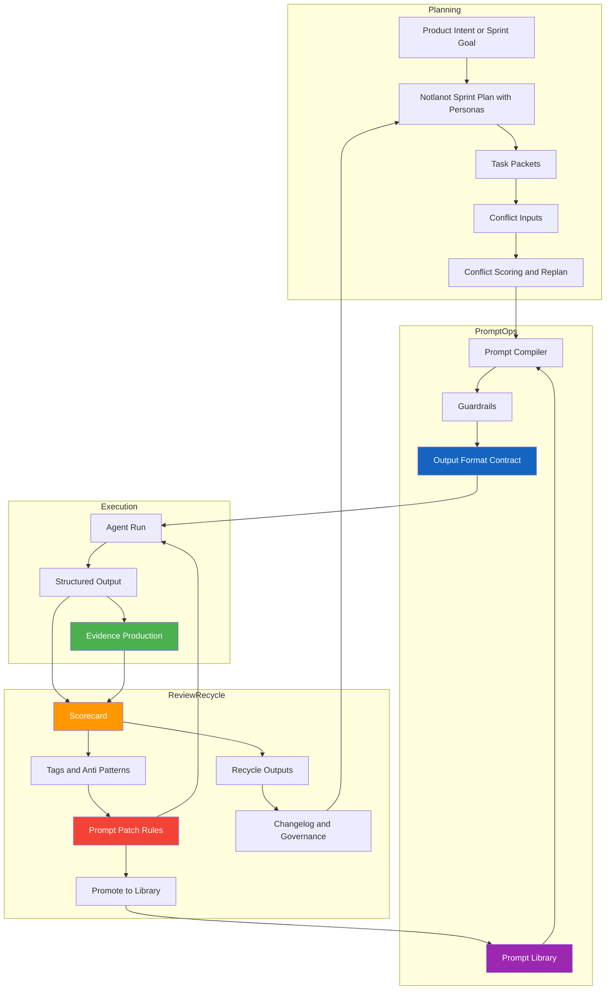

# Agent Behavior Development (ABD)

Agent Behavior Development (ABD) is a software development paradigm that treats
**agent behavior** as the primary engineering artifact.

In ABD:
- Code is not the first-class citizen.
- Prompts, guardrails, output formats, review rules, and recycle loops are.

This repository does not provide tools.
It defines a **development paradigm**, not an SDK.

---

## One-Sentence Definition

> **Agent Behavior Development (ABD)** is a paradigm where humans design and evolve the behavior of agents, and code is a byproduct validated by evidence.

---

---

## Why ABD Exists

Traditional development paradigms assume:
- Humans write specifications.
- Humans write tests.
- Humans write most of the code.
- Tools assist.

That assumption no longer holds.

Modern agents:
- Propose behaviors
- Generate test strategies
- Produce implementation drafts

Yet teams still:
- Debug code instead of behavior
- Retry prompts instead of fixing agent constraints
- Treat prompt failures as one-off accidents

ABD exists to systematize agent behavior improvement.

---

## The Core Shift: Code → Behavior

The defining shift of ABD is simple:

> **The primary refactoring target is agent behavior, not code.**

In ABD, when output quality is poor:
1) Fix the prompt
2) Tighten guardrails
3) Lock output formats
4) Improve review rules
5) Strengthen recycle logic  
**Only then** adjust code.

---

## What ABD Is

ABD is:
- Agent-first, not agent-autonomous
- Behavior-driven, not prompt-driven
- Evidence-oriented, not test-obsessed
- Governance-heavy, not “just try again”

ABD introduces:
- Prompt-as-artifact discipline
- Behavior scorecards
- Mandatory recycle outputs
- Conflict-aware task planning
- Agent behavior retrospectives

---

## What ABD Is Not

ABD is NOT:
- AI-assisted TDD
- BDD automation
- “Let the agent do everything”
- Prompt engineering tips
- A replacement for Scrum

ABD complements Scrum by adding an **agent behavior governance layer**.

---

## ABD vs TDD vs BDD

| Aspect | TDD | BDD | ABD |
|-----|-----|-----|-----|
| Who defines behavior | Human | Human | Agent (under rules) |
| Primary artifact | Test | Scenario | Prompt + Guardrails |
| What is refactored | Code | Code | Agent behavior |
| Failure resolution | Rewrite code | Rewrite scenario | Patch prompt/flow |
| Evidence | Tests | Scenarios | Tests, checks, demos |
| Paradigm focus | Code correctness | Business behavior | Behavior production system |

TDD and BDD are **techniques** in ABD, not paradigms.

---

## Non-Negotiable Rules (v1)

1) Agent output must follow a fixed format.
2) Evidence must be proposed before implementation.
3) Assumptions must be explicit.
4) Agents may ask up to 3 questions and must stop.
5) Every task must produce recycle outputs.
6) Behavior changes must be versioned.

---

## Repository Map

- `MANIFESTO.md` → Hard rules of the paradigm
- `0_introduction/` → What ABD is and is not
- `1_core/` → Principles and artifacts
- `2_process/` → Lifecycle, sprint and task models
- `3_promptops/` → Prompt operations and metrics
- `4_templates/` → Ready-to-use templates
- `5_examples/` → End-to-end worked examples

---

## First-Week Adoption Guide

Day 1:
- Read MANIFESTO
- Use the core prompt template for one task
- Score the output

Day 2–3:
- Run 3 more tasks
- Tag recurring failures

Day 4:
- Patch the prompt
- Document behavior improvement

Day 5:
- Sprint review focused on agent behavior, not features
